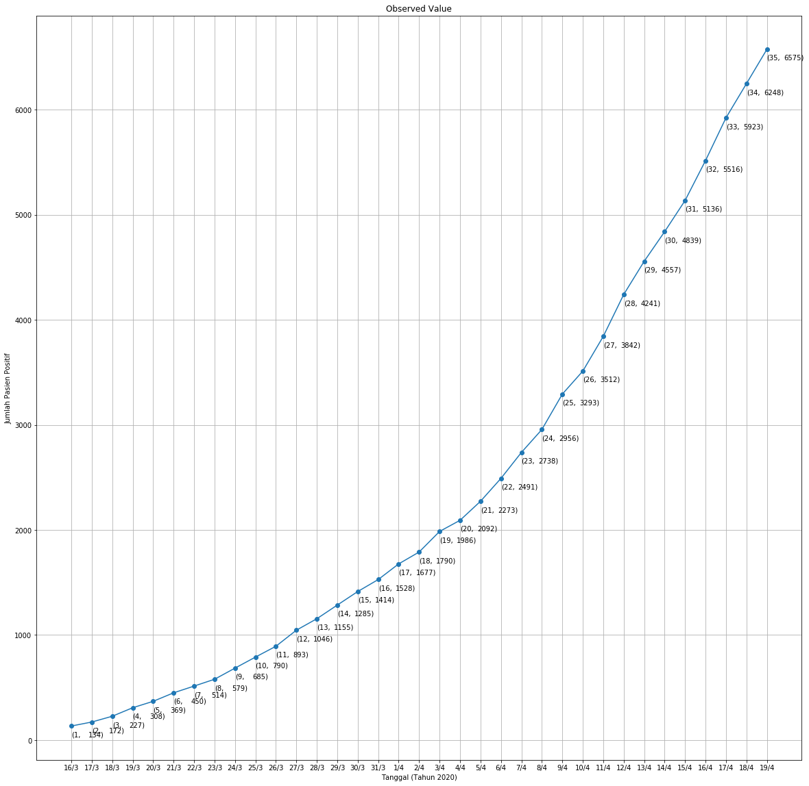
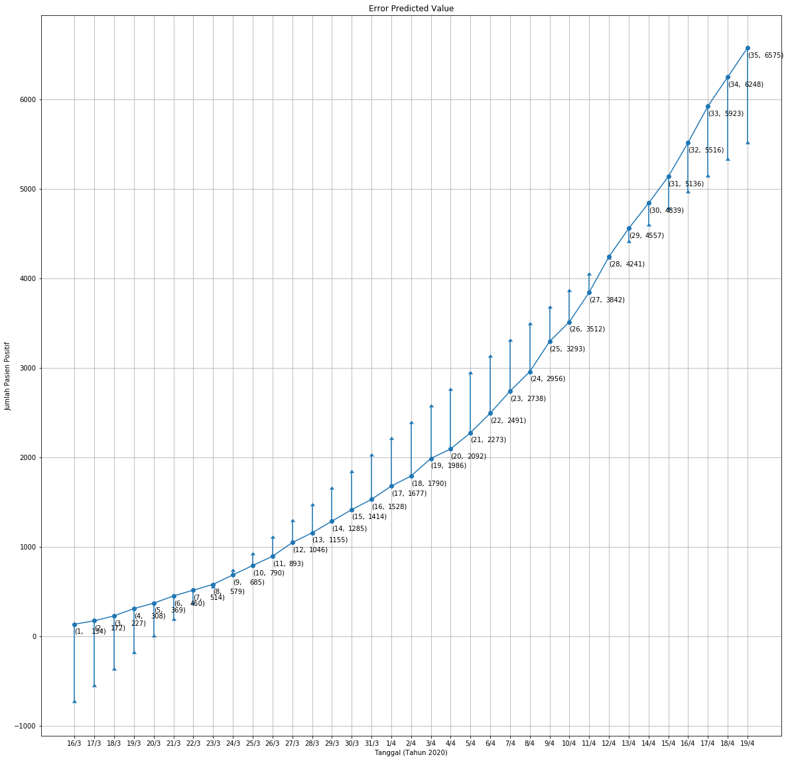

# Prediksi Kasus Postif COVID-19 dengan menggunakan Linier Regression

**Oleh Zandy Yudha Perwira**

---

## **What’s Linear Regression???**

**Linear regression is a linear approach to modeling the relationship between a dependent variable and one or more independent variables.**

# 1. Import Library


```python
import pandas as pd
import numpy as np
import matplotlib.pyplot as plt
import sqlite3
import os
```

# 2. Membuat Kelas Regresi Linier

Dalam kelas ini pada intinya akan menghitung nilai koefisien b0 serta b1, residu, dan RMSE:
$$
\begin{aligned}
  y = b0 + b1x \\ \\
  b0 = interception \\
  b1 = slope \\
\end{aligned} $$

* Mencari Koefisien b0 dan b1 dengan persamaan berikut:
$$
\begin{aligned}
  b0 = \frac{\sum_{i=1}^{n} y - b1 \sum_{i=1}^{n} x} {n} \\
  b1 = \frac{n \sum_{i=1}^{n} xy - b1 \sum_{i=1}^{n} x \sum_{i=1}^{n} y} {\sum_{i=1}^{n} x^2 - (\sum_{i=1}^{n})^2} \\
\end{aligned}$$

* Mencari Residu:
$$
\begin{aligned}
  SSE = \sum_{i=1}^{n} {(y_{observed} - y_{predicted})}^2 \\
  TSS = \sum_{i=1}^{n} {(y_{observed} - \overline {y}_{observed})}^2 \\
  R^2 = 1 - \frac {SSE}{TSS}
\end{aligned}$$

* Mencari RMSE:
$$
\begin{aligned}
  RMSE = \sqrt {\frac {\sum_{i=1}^{n} {(y_{observed} - y_{predicted})}^2}{n}} \\
\end{aligned}$$


```python
class LinearRegression:
    def __init__(self, start_date, number_initial_case, addition_case_data):
        dates = pd.date_range(start_date, periods=len(addition_case_data) + 1) 
        self.start_date = start_date
        self.total_positive_accumulative = pd.DataFrame([[0, number_initial_case]], index=[dates[0]], columns=['Penambahan Kasus Positif','Total Kasus Positif'])

        cumulative_positive = number_initial_case
        for idx, addition_case in enumerate(addition_case_data):
            cumulative_positive += addition_case[1]
            temp = pd.DataFrame([[addition_case[1], cumulative_positive]], columns=['Penambahan Kasus Positif','Total Kasus Positif'], index=[dates[idx+1]])
            self.total_positive_accumulative = self.total_positive_accumulative.append(temp)
        
        self.compute_coefficients()
    
    def average(self, data):
        return sum(data) / len(data)

    def covariance(self, data_x, data_y, avg_x, avg_y):
        cov = 0
        for i in range(len(data_x)):
            cov += (data_x[i] - avg_x) * (data_y[i] - avg_y)
        return cov

    def variance(self, data, avg):
        var = 0
        for i in data:
            var += (i - avg) ** 2
        return var

    def compute_coefficients(self):
        data_x = range(1, len(self.total_positive_accumulative) + 1)
        data_y = self.total_positive_accumulative['Total Kasus Positif']
        avg_x = self.average(data_x)
        avg_y = self.average(data_y)
        
        self.b1 = self.covariance(data_x, data_y, avg_x, avg_y) / self.variance(data_x, avg_x)
        self.b0 = avg_y - (self.b1 * avg_x)

        return self.b0, self.b1

    def predict(self, b0, b1, data, days):
        dates = pd.date_range('20200316', periods=len(data) + days + 1)
        temp = []
        for x in range(1, len(data) + days + 1):
            temp.append([x, dates[x], b0 + (b1 * x)])
        return temp
    
    def compute_prediction(self, days):
        dates = pd.date_range(self.start_date, periods=len(self.total_positive_accumulative) + days)
        
        temp = []
        for x in range(1, len(self.total_positive_accumulative) + days + 1):
            if x <= len(self.total_positive_accumulative):
                buffer = pd.DataFrame([[self.total_positive_accumulative['Penambahan Kasus Positif'][x-1], 
                                        self.total_positive_accumulative['Total Kasus Positif'][x-1],
                                        self.b0 + (self.b1 * x)]],
                                      columns=['Penambahan Kasus Positif',
                                               'Total Kasus Positif',
                                               'Prediksi Total Kasus Positif'],
                                      index=[dates[x - 1]])
            else:     
                buffer = pd.DataFrame([[np.nan, 
                                        np.nan,
                                        self.b0 + (self.b1 * x)]],
                                      columns=['Penambahan Kasus Positif',
                                               'Total Kasus Positif',
                                               'Prediksi Total Kasus Positif'],
                                      index=[dates[x - 1]])
            temp.append(buffer)
        
        self.prediction = pd.concat(temp)
        return self.prediction
    
    def sse(self, observed_value, predict_value):
        temp = 0
        for o,p in zip(observed_value, predict_value):
            temp += (o - p) ** 2
        return temp

    def tss(self, observed_value, avg_observed_value):
        temp = 0
        for o in observed_value:
            temp += (o - avg_observed_value) ** 2
        return temp

    def residue(self):
        observed_value = self.total_positive_accumulative['Total Kasus Positif']
        predicted_value = self.prediction['Prediksi Total Kasus Positif']
        avg_observed_value = self.average(observed_value)
        return 1 - (self.sse(observed_value, predicted_value) / self.tss(observed_value, avg_observed_value))

    def rmse(self):
        observed_value = self.total_positive_accumulative['Total Kasus Positif']
        predicted_value = self.prediction['Prediksi Total Kasus Positif']
        temp = 0
        for o,p in zip(observed_value, predicted_value):
            temp += (o - p) ** 2   
        return (temp / len(observed_value)) ** 0.5
    
    def save_data_to_sqlite(self):
        conn = sqlite3.connect('predict_data.sqlite')
        cur = conn.cursor()
        
        if not os.path.exists('predict_data.sqlite'):
            cur.execute('CREATE TABLE data_linear (tgl DATE, observed_x INT, observed_y INT, predicted_x INT, predicted_y INT)')
            conn.commit()
            
            cur.execute('CREATE TABLE linear_coefficients (b0 INT, b1 INT)')
            conn.commit()
        else:
            cur.execute('DROP TABLE data_linear')
            conn.commit()
            
            cur.execute('DROP TABLE linear_coefficients')
            conn.commit()
            
            cur.execute('CREATE TABLE data_linear (tgl DATE, observed_x INT, observed_y INT, predicted_x INT, predicted_y INT)')
            conn.commit()
            
            cur.execute('CREATE TABLE linear_coefficients (b0 INT, b1 INT)')
            conn.commit()
        
        dates = pd.date_range(self.start_date, periods=len(self.prediction) + 1)
        print(dates)

        
        for a,b,c,d,e in zip(dates, range(1, len(self.total_positive_accumulative) + 1), self.total_positive_accumulative['Total Kasus Positif'], range(1, len(self.total_positive_accumulative) + 1), self.prediction['Prediksi Total Kasus Positif']):
            cur.execute('INSERT INTO data_linear (tgl, observed_x, observed_y, predicted_x, predicted_y) values ("{}", {}, {}, {}, {})'.format(str(a)[:10], b, c, d, e))
            conn.commit()

        for i in range(len(self.total_positive_accumulative), len(self.prediction)):
            cur.execute('INSERT INTO data_linear (tgl, observed_x, observed_y, predicted_x, predicted_y) values ("{}", null, null, {}, {})'.format(str(dates[i])[:10], i+1, self.prediction['Prediksi Total Kasus Positif'][i]))
            conn.commit()

        cur.execute('INSERT INTO linear_coefficients (b0, b1) values ({}, {})'.format(self.b0, self.b1))
        conn.commit()
        conn.close()
```

# 2. Mendefiniskan Data Pasien Positif Covid-19 di Indonesia [^1]

## - Data penambahan kasus Covid-19 di Indonesia


```python
addition_case_positive_covid = [[17, 38],
                                [18, 55],
                                [19, 81],
                                [20, 61],
                                [21, 81],
                                [22, 64],
                                [23, 65],
                                [24, 106],
                                [25, 105],
                                [26, 103],
                                [27, 153],
                                [28, 109],
                                [29, 130],
                                [30, 129],
                                [31, 114],
                                [1, 149],
                                [2, 113],
                                [3, 196],
                                [4, 106],
                                [5, 181],
                                [6, 218],
                                [7, 247],
                                [8, 218],
                                [9, 337],
                                [10, 219],
                                [11, 330],
                                [12, 399],
                                [13, 316],
                                [14, 282],
                                [15, 297],
                                [16, 380],
                                [17, 407],
                                [18, 325],
                                [19, 327],
                         ]
```


```python
covid19 = LinearRegression('20200316', 134, addition_case_data=addition_case_positive_covid)
```

## - Mengitung Total Akumulasi Positif Covid-19

$$
\begin{align*}
  total-pasien-positif = total-positif-awal + \sum_{n=0}^{N} penambahan[n] \\
\end{align*}$$


total-pasien-positif = jumlah pasien seluruhnya,
total-positif-awal = jumlah pasien pada data yang pertama (hari pertama),
N = selisih hari awal dengan hari yang akan dicari


```python
total_positive_accumulative = covid19.total_positive_accumulative
total_positive_accumulative
```


<div>
<style scoped>
    .dataframe tbody tr th:only-of-type {
        vertical-align: middle;
    }

    .dataframe tbody tr th {
        vertical-align: top;
    }

    .dataframe thead th {
        text-align: right;
    }
</style>
<table border="1" class="dataframe">
  <thead>
    <tr style="text-align: right;">
      <th></th>
      <th>Penambahan Kasus Positif</th>
      <th>Total Kasus Positif</th>
    </tr>
  </thead>
  <tbody>
    <tr>
      <th>2020-03-16</th>
      <td>0</td>
      <td>134</td>
    </tr>
    <tr>
      <th>2020-03-17</th>
      <td>38</td>
      <td>172</td>
    </tr>
    <tr>
      <th>2020-03-18</th>
      <td>55</td>
      <td>227</td>
    </tr>
    <tr>
      <th>2020-03-19</th>
      <td>81</td>
      <td>308</td>
    </tr>
    <tr>
      <th>2020-03-20</th>
      <td>61</td>
      <td>369</td>
    </tr>
    <tr>
      <th>2020-03-21</th>
      <td>81</td>
      <td>450</td>
    </tr>
    <tr>
      <th>2020-03-22</th>
      <td>64</td>
      <td>514</td>
    </tr>
    <tr>
      <th>2020-03-23</th>
      <td>65</td>
      <td>579</td>
    </tr>
    <tr>
      <th>2020-03-24</th>
      <td>106</td>
      <td>685</td>
    </tr>
    <tr>
      <th>2020-03-25</th>
      <td>105</td>
      <td>790</td>
    </tr>
    <tr>
      <th>2020-03-26</th>
      <td>103</td>
      <td>893</td>
    </tr>
    <tr>
      <th>2020-03-27</th>
      <td>153</td>
      <td>1046</td>
    </tr>
    <tr>
      <th>2020-03-28</th>
      <td>109</td>
      <td>1155</td>
    </tr>
    <tr>
      <th>2020-03-29</th>
      <td>130</td>
      <td>1285</td>
    </tr>
    <tr>
      <th>2020-03-30</th>
      <td>129</td>
      <td>1414</td>
    </tr>
    <tr>
      <th>2020-03-31</th>
      <td>114</td>
      <td>1528</td>
    </tr>
    <tr>
      <th>2020-04-01</th>
      <td>149</td>
      <td>1677</td>
    </tr>
    <tr>
      <th>2020-04-02</th>
      <td>113</td>
      <td>1790</td>
    </tr>
    <tr>
      <th>2020-04-03</th>
      <td>196</td>
      <td>1986</td>
    </tr>
    <tr>
      <th>2020-04-04</th>
      <td>106</td>
      <td>2092</td>
    </tr>
    <tr>
      <th>2020-04-05</th>
      <td>181</td>
      <td>2273</td>
    </tr>
    <tr>
      <th>2020-04-06</th>
      <td>218</td>
      <td>2491</td>
    </tr>
    <tr>
      <th>2020-04-07</th>
      <td>247</td>
      <td>2738</td>
    </tr>
    <tr>
      <th>2020-04-08</th>
      <td>218</td>
      <td>2956</td>
    </tr>
    <tr>
      <th>2020-04-09</th>
      <td>337</td>
      <td>3293</td>
    </tr>
    <tr>
      <th>2020-04-10</th>
      <td>219</td>
      <td>3512</td>
    </tr>
    <tr>
      <th>2020-04-11</th>
      <td>330</td>
      <td>3842</td>
    </tr>
    <tr>
      <th>2020-04-12</th>
      <td>399</td>
      <td>4241</td>
    </tr>
    <tr>
      <th>2020-04-13</th>
      <td>316</td>
      <td>4557</td>
    </tr>
    <tr>
      <th>2020-04-14</th>
      <td>282</td>
      <td>4839</td>
    </tr>
    <tr>
      <th>2020-04-15</th>
      <td>297</td>
      <td>5136</td>
    </tr>
    <tr>
      <th>2020-04-16</th>
      <td>380</td>
      <td>5516</td>
    </tr>
    <tr>
      <th>2020-04-17</th>
      <td>407</td>
      <td>5923</td>
    </tr>
    <tr>
      <th>2020-04-18</th>
      <td>325</td>
      <td>6248</td>
    </tr>
    <tr>
      <th>2020-04-19</th>
      <td>327</td>
      <td>6575</td>
    </tr>
  </tbody>
</table>
</div>


# 3.Plot Grafik Total Pasien Covid-19


```python
plt.figure(figsize=(20,20))
plt.title('Observed Value')
plt.xlabel('Tanggal (Tahun 2020)')
plt.ylabel('Jumlah Pasien Positif')

dates = pd.date_range(covid19.start_date, periods=len(total_positive_accumulative))

plt.plot([d.strftime("%-d/%-m") for d in dates], total_positive_accumulative['Total Kasus Positif'], marker='o', label='Observed Value')

for i,j in zip(range(0, len(total_positive_accumulative)), total_positive_accumulative['Total Kasus Positif']):
    plt.annotate('%i)' %j, xy=(i,j-100), xytext=(25,0), textcoords='offset points')
    plt.annotate('(%i,' %(i+1), xy=(i,j-100))
    
fig_manager = plt.get_current_fig_manager()
if hasattr(fig_manager, 'window'):
    fig_manager.window.showMaximized()

plt.grid()
plt.show()
```





# 4. Menghitung Prediksi 5 hari kedepan


```python
prediction = covid19.compute_prediction(days=5)
prediction
```


<div>
<style scoped>
    .dataframe tbody tr th:only-of-type {
        vertical-align: middle;
    }

    .dataframe tbody tr th {
        vertical-align: top;
    }

    .dataframe thead th {
        text-align: right;
    }
</style>
<table border="1" class="dataframe">
  <thead>
    <tr style="text-align: right;">
      <th></th>
      <th>Penambahan Kasus Positif</th>
      <th>Total Kasus Positif</th>
      <th>Prediksi Total Kasus Positif</th>
    </tr>
  </thead>
  <tbody>
    <tr>
      <th>2020-03-16</th>
      <td>0.0</td>
      <td>134.0</td>
      <td>-745.690476</td>
    </tr>
    <tr>
      <th>2020-03-17</th>
      <td>38.0</td>
      <td>172.0</td>
      <td>-561.937255</td>
    </tr>
    <tr>
      <th>2020-03-18</th>
      <td>55.0</td>
      <td>227.0</td>
      <td>-378.184034</td>
    </tr>
    <tr>
      <th>2020-03-19</th>
      <td>81.0</td>
      <td>308.0</td>
      <td>-194.430812</td>
    </tr>
    <tr>
      <th>2020-03-20</th>
      <td>61.0</td>
      <td>369.0</td>
      <td>-10.677591</td>
    </tr>
    <tr>
      <th>2020-03-21</th>
      <td>81.0</td>
      <td>450.0</td>
      <td>173.075630</td>
    </tr>
    <tr>
      <th>2020-03-22</th>
      <td>64.0</td>
      <td>514.0</td>
      <td>356.828852</td>
    </tr>
    <tr>
      <th>2020-03-23</th>
      <td>65.0</td>
      <td>579.0</td>
      <td>540.582073</td>
    </tr>
    <tr>
      <th>2020-03-24</th>
      <td>106.0</td>
      <td>685.0</td>
      <td>724.335294</td>
    </tr>
    <tr>
      <th>2020-03-25</th>
      <td>105.0</td>
      <td>790.0</td>
      <td>908.088515</td>
    </tr>
    <tr>
      <th>2020-03-26</th>
      <td>103.0</td>
      <td>893.0</td>
      <td>1091.841737</td>
    </tr>
    <tr>
      <th>2020-03-27</th>
      <td>153.0</td>
      <td>1046.0</td>
      <td>1275.594958</td>
    </tr>
    <tr>
      <th>2020-03-28</th>
      <td>109.0</td>
      <td>1155.0</td>
      <td>1459.348179</td>
    </tr>
    <tr>
      <th>2020-03-29</th>
      <td>130.0</td>
      <td>1285.0</td>
      <td>1643.101401</td>
    </tr>
    <tr>
      <th>2020-03-30</th>
      <td>129.0</td>
      <td>1414.0</td>
      <td>1826.854622</td>
    </tr>
    <tr>
      <th>2020-03-31</th>
      <td>114.0</td>
      <td>1528.0</td>
      <td>2010.607843</td>
    </tr>
    <tr>
      <th>2020-04-01</th>
      <td>149.0</td>
      <td>1677.0</td>
      <td>2194.361064</td>
    </tr>
    <tr>
      <th>2020-04-02</th>
      <td>113.0</td>
      <td>1790.0</td>
      <td>2378.114286</td>
    </tr>
    <tr>
      <th>2020-04-03</th>
      <td>196.0</td>
      <td>1986.0</td>
      <td>2561.867507</td>
    </tr>
    <tr>
      <th>2020-04-04</th>
      <td>106.0</td>
      <td>2092.0</td>
      <td>2745.620728</td>
    </tr>
    <tr>
      <th>2020-04-05</th>
      <td>181.0</td>
      <td>2273.0</td>
      <td>2929.373950</td>
    </tr>
    <tr>
      <th>2020-04-06</th>
      <td>218.0</td>
      <td>2491.0</td>
      <td>3113.127171</td>
    </tr>
    <tr>
      <th>2020-04-07</th>
      <td>247.0</td>
      <td>2738.0</td>
      <td>3296.880392</td>
    </tr>
    <tr>
      <th>2020-04-08</th>
      <td>218.0</td>
      <td>2956.0</td>
      <td>3480.633613</td>
    </tr>
    <tr>
      <th>2020-04-09</th>
      <td>337.0</td>
      <td>3293.0</td>
      <td>3664.386835</td>
    </tr>
    <tr>
      <th>2020-04-10</th>
      <td>219.0</td>
      <td>3512.0</td>
      <td>3848.140056</td>
    </tr>
    <tr>
      <th>2020-04-11</th>
      <td>330.0</td>
      <td>3842.0</td>
      <td>4031.893277</td>
    </tr>
    <tr>
      <th>2020-04-12</th>
      <td>399.0</td>
      <td>4241.0</td>
      <td>4215.646499</td>
    </tr>
    <tr>
      <th>2020-04-13</th>
      <td>316.0</td>
      <td>4557.0</td>
      <td>4399.399720</td>
    </tr>
    <tr>
      <th>2020-04-14</th>
      <td>282.0</td>
      <td>4839.0</td>
      <td>4583.152941</td>
    </tr>
    <tr>
      <th>2020-04-15</th>
      <td>297.0</td>
      <td>5136.0</td>
      <td>4766.906162</td>
    </tr>
    <tr>
      <th>2020-04-16</th>
      <td>380.0</td>
      <td>5516.0</td>
      <td>4950.659384</td>
    </tr>
    <tr>
      <th>2020-04-17</th>
      <td>407.0</td>
      <td>5923.0</td>
      <td>5134.412605</td>
    </tr>
    <tr>
      <th>2020-04-18</th>
      <td>325.0</td>
      <td>6248.0</td>
      <td>5318.165826</td>
    </tr>
    <tr>
      <th>2020-04-19</th>
      <td>327.0</td>
      <td>6575.0</td>
      <td>5501.919048</td>
    </tr>
    <tr>
      <th>2020-04-20</th>
      <td>NaN</td>
      <td>NaN</td>
      <td>5685.672269</td>
    </tr>
    <tr>
      <th>2020-04-21</th>
      <td>NaN</td>
      <td>NaN</td>
      <td>5869.425490</td>
    </tr>
    <tr>
      <th>2020-04-22</th>
      <td>NaN</td>
      <td>NaN</td>
      <td>6053.178711</td>
    </tr>
    <tr>
      <th>2020-04-23</th>
      <td>NaN</td>
      <td>NaN</td>
      <td>6236.931933</td>
    </tr>
    <tr>
      <th>2020-04-24</th>
      <td>NaN</td>
      <td>NaN</td>
      <td>6420.685154</td>
    </tr>
  </tbody>
</table>
</div>


# 5. Plotting Hasil

## - Plot Data Observasi vs Data Prediksi


```python
prediction = covid19.prediction

dates = pd.date_range(covid19.start_date, periods=len(prediction))

plt.figure(figsize=(20,20))
plt.scatter([d.strftime("%-d/%-m") for d in dates[:len(total_positive_accumulative)]], total_positive_accumulative['Total Kasus Positif'], linestyle='dashed', marker='o', c='r', label='Observed Value')
plt.plot([d.strftime("%-d/%-m") for d in dates], prediction['Prediksi Total Kasus Positif'], marker='o', label='Predicted Value')

for i,j in zip(range(0, len(total_positive_accumulative)), total_positive_accumulative['Total Kasus Positif']):
    plt.annotate('%i)' %j, xy=(i,j-100), xytext=(25,0), textcoords='offset points')
    plt.annotate('(%i,' %(i+1), xy=(i,j-100))
    
for k,l in zip(range(0, len(prediction)), prediction['Prediksi Total Kasus Positif']):
    plt.annotate('%i)' %l, xy=(k,l+500), xytext=(25,0), textcoords='offset points')
    plt.annotate('(%i,' %(k+1), xy=(k,l+500))
    
fig_manager = plt.get_current_fig_manager()
if hasattr(fig_manager, 'window'):
    fig_manager.window.showMaximized()
    
plt.legend(loc='upper center', bbox_to_anchor=(0.5, 1.00), shadow=True, ncol=2)
plt.xlabel('Tanggal (Tahun 2020)')
plt.ylabel('Jumlah Pasien Positif')
plt.title('Observed vs Predicted Value')

plt.grid()
plt.show()
```


## - Plot Error Data Prediksi


```python
error = [x - y for x,y in zip(prediction['Prediksi Total Kasus Positif'], total_positive_accumulative['Total Kasus Positif'])]

dates = pd.date_range(covid19.start_date, periods=len(total_positive_accumulative))

plt.figure(figsize=(20,20))
plt.title('Error Predicted Value')
plt.xlabel('Tanggal (Tahun 2020)')
plt.ylabel('Jumlah Pasien Positif')

plt.errorbar([d.strftime("%-d/%-m") for d in dates], total_positive_accumulative['Total Kasus Positif'], marker='o', label='Observed Value', yerr=error, lolims=True)

for i,j in zip(range(0, len(total_positive_accumulative)), total_positive_accumulative['Total Kasus Positif']):
    plt.annotate('%i)' %j, xy=(i,j-100), xytext=(25,0), textcoords='offset points')
    plt.annotate('(%i,' %(i+1), xy=(i,j-100))
    
fig_manager = plt.get_current_fig_manager()
if hasattr(fig_manager, 'window'):
    fig_manager.window.showMaximized()

plt.grid()
plt.show()
```





# 6. Menghitung Residue dan RMSE (Root Mean Squared-Error)


```python
print('R^2: ', covid19.residue())
```

    R^2:  0.9293782942471546


```python
print('RMSE: ', covid19.rmse())
```

    RMSE:  511.5733191638831


# 7. Menyimpan Data to SQLite


```python
covid19.save_data_to_sqlite()
```

    DatetimeIndex(['2020-03-16', '2020-03-17', '2020-03-18', '2020-03-19',
                   '2020-03-20', '2020-03-21', '2020-03-22', '2020-03-23',
                   '2020-03-24', '2020-03-25', '2020-03-26', '2020-03-27',
                   '2020-03-28', '2020-03-29', '2020-03-30', '2020-03-31',
                   '2020-04-01', '2020-04-02', '2020-04-03', '2020-04-04',
                   '2020-04-05', '2020-04-06', '2020-04-07', '2020-04-08',
                   '2020-04-09', '2020-04-10', '2020-04-11', '2020-04-12',
                   '2020-04-13', '2020-04-14', '2020-04-15', '2020-04-16',
                   '2020-04-17', '2020-04-18', '2020-04-19', '2020-04-20',
                   '2020-04-21', '2020-04-22', '2020-04-23', '2020-04-24',
                   '2020-04-25'],
                  dtype='datetime64[ns]', freq='D')

